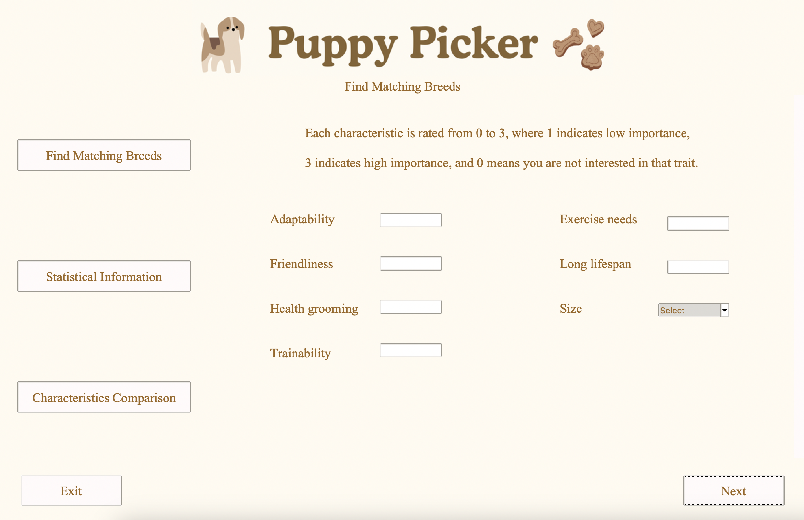
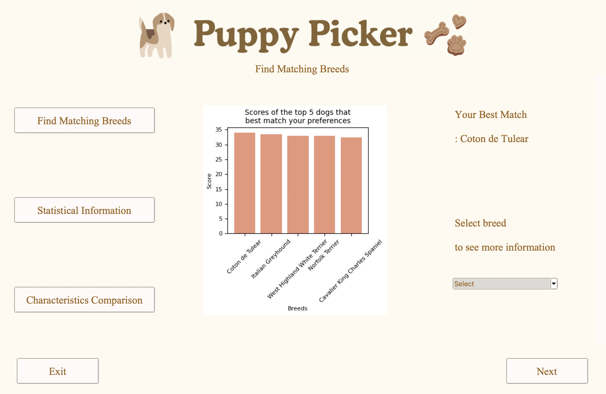
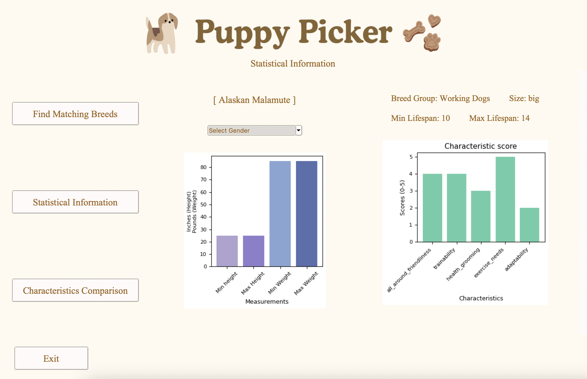
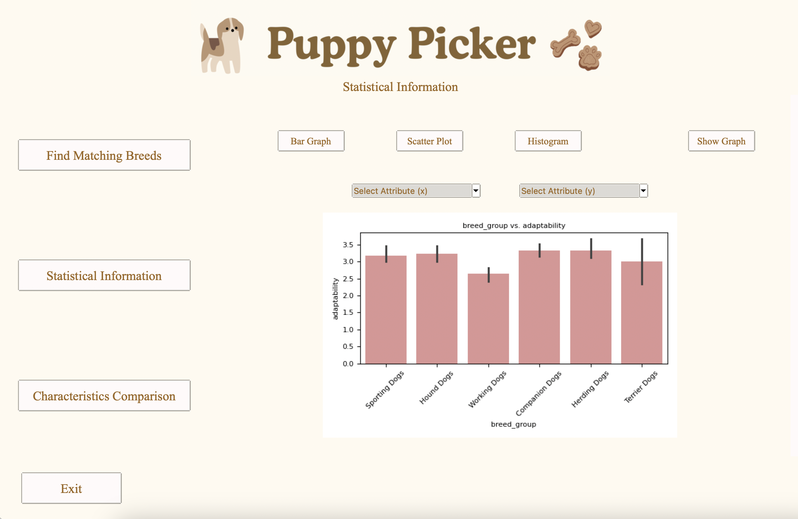
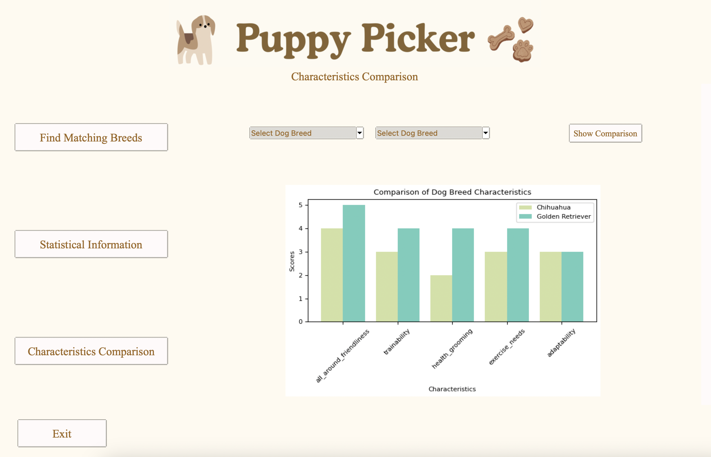

# PuppyPicker

The program is designed to help users find the ideal dog breed by exploring traits through graphs and offering personalized recommendations. It simplifies the breed selection process by enabling users to view and compare characteristics of various breeds and receive customized suggestions based on their preferences.

## Main features
- **Find Matching Breeds:** This feature recommends dog breeds that align with the user's preferences. Users can specify how important each characteristic is to them. Before entering their preferences, users are presented with a storytelling page that shares insightful, data-driven stories about dog ownership.
- **Statistical Information:** This function provides detailed information about each dog breed. Users can select specific attributes of a breed to explore statistical data, helping them make informed decisions.
- **Characteristic Comparison:** Allows users to compare the characteristics of two chosen dog breeds side by side. This feature aids in highlighting differences and similarities, assisting users in distinguishing which breed may be better suited to their needs.

## Installation

### Software requirement
Python 3.11  
### Setup

Clone the repository:
```
git clone https://github.com/niichapats/PuppyPicker.git
```
Navigate to the repository directory:
```
cd PuppyPicker
```
Create and activate a virtual environment (optional): 
For macOS/Linux:
```
python3 -m venv env
. env/bin/activate
```
For Windows:
```
python -m venv env
.\env\Scripts\activate
```
Install required packages in requirements.txt:
```
pip install -r requirements.txt
```

### Run the program
To run the program, execute the following command in the terminal:
```
python main.py
```

Or if you are using a Unix-like system, you might prefer:
```
python3 main.py
```

## Example UI

| Menu                                       | Example UI                         |
|--------------------------------------------|------------------------------------|
| Find Matching Breeds                       |      |
| Find Matching Breeds                       |      |
| Statistical Information (Dog Information)  |    |
| Statistical Information (Data Exploration) |     |
| Characteristic Comparison                  |     |


## Project Documents
[Project Proposal](https://docs.google.com/document/d/1PfOkQNRNssTYF7hYASw-kZtYws7OuAx6x-9RGq7cPsQ/edit?usp=sharing)  
[Development Plan](https://github.com/niichapats/PuppyPicker/wiki/Development-Plan)  
[UML Diagrams](https://github.com/niichapats/PuppyPicker/wiki/UML-Diagrams)  

## Sources of data
[Dog Breeds dataset 1](https://www.kaggle.com/datasets/mexwell/dog-breeds-dogtime-dataset)  
[Dog Breeds dataset 2](https://www.kaggle.com/datasets/warcoder/dog-breeds-details)
